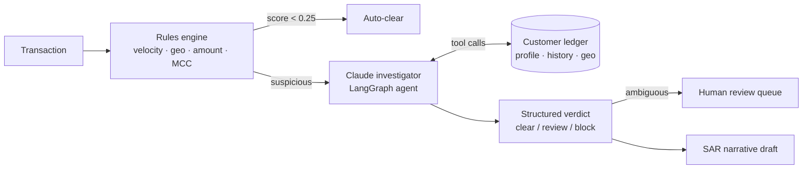

# Fraud Triage Agent — LangGraph + Claude

An agentic fraud-detection pipeline for card transactions. A deterministic
rules engine screens every transaction; suspicious ones are escalated to a
**Claude-powered investigation agent** (LangGraph) that queries the customer
ledger with tools, weighs the evidence, and issues a structured verdict with
a draft **SAR (Suspicious Activity Report) narrative** for analysts.

The design point: **GenAI is not the classifier.** Cheap, auditable rules
produce the signals and gate the LLM — clean transactions never cost a
model call. Claude does what rules can't: contextual reasoning over the
evidence and analyst-quality explanations.

## Architecture



- **`screen`** — pure-Python checks: transaction velocity, impossible travel
  (haversine speed), amount z-score vs. customer baseline, high-risk MCC at
  a new merchant. Composite score gates escalation.
- **`investigate`** — Claude (`claude-opus-4-8`) with four tools
  (`get_customer_profile`, `get_recent_transactions`,
  `check_transaction_velocity`, `check_geo_feasibility`) in a LangGraph
  agent loop.
- **`verdict`** — structured output (`FraudVerdict` Pydantic schema):
  verdict, 0–100 risk score, key signals, rationale, SAR narrative.
- **`human_review`** — review verdicts and mid-band risk scores are queued
  for an analyst instead of auto-actioned.

## Quickstart

```bash
python3 -m venv .venv && source .venv/bin/activate
pip install -r requirements.txt

# offline test suite (no API key needed — stub LLM)
pytest tests/ -v

# live demo over 4 labeled scenarios (needs a key)
cp .env.example .env   # add your ANTHROPIC_API_KEY
python demo.py

# or run on Groq (free tier) instead of Anthropic:
# set LLM_PROVIDER=groq and GROQ_API_KEY in .env — defaults to llama-3.3-70b-versatile.
# Claude gives noticeably stronger investigations and SAR narratives; the
# rules engine and routing are deterministic and provider-independent.

# API server
uvicorn fraud_triage.api:app --reload
# POST /triage with a transaction JSON, GET /health
```

## Synthetic data & scenarios

`fraud_triage/data/generator.py` builds a seeded, deterministic dataset:
4 customers with ~60 days of benign history each, plus labeled scenarios:

| Scenario | Pattern | Expected outcome |
|---|---|---|
| `legit` | Normal purchase near home | Auto-clear, no LLM call |
| `velocity_burst` | 5 card-not-present hits in 45 min at risky merchants | Block |
| `impossible_travel` | Home purchase, then another continent 2h later | Block |
| `amount_spike` | 15–30× baseline amount at a crypto exchange | Block/review |

## Testing without an API key

`tests/conftest.py` injects a `StubLLM` that satisfies the two interfaces
the graph uses (`bind_tools`, `with_structured_output`), so the full graph —
routing, tool node, verdict schema, human-review branch, FastAPI endpoint —
runs offline. 14 tests, <1s.

## Design notes

- **Cost control**: the auto-clear branch means the vast majority of real
  traffic never reaches the model; only rule-flagged transactions pay for
  an investigation (~2–4 tool calls each).
- **No sampling params**: Claude Opus 4.8 rejects `temperature`/`top_p`
  with a 400 — the `ChatAnthropic` client is constructed without them.
- **Auditability**: every verdict carries the deterministic rule flags that
  triggered escalation *and* the model's cited evidence, so an analyst can
  reconstruct the decision.

## Tech stack

LangGraph · langchain-anthropic (Claude Opus 4.8) · FastAPI · Pydantic v2 · pytest
